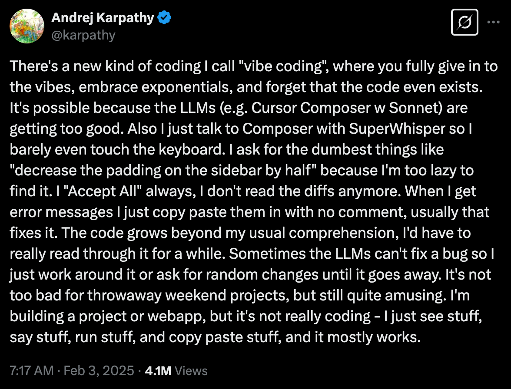
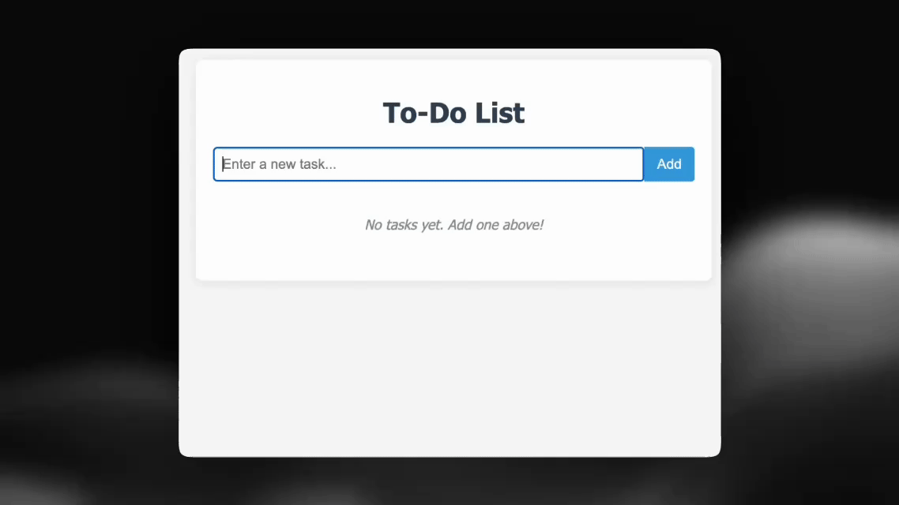
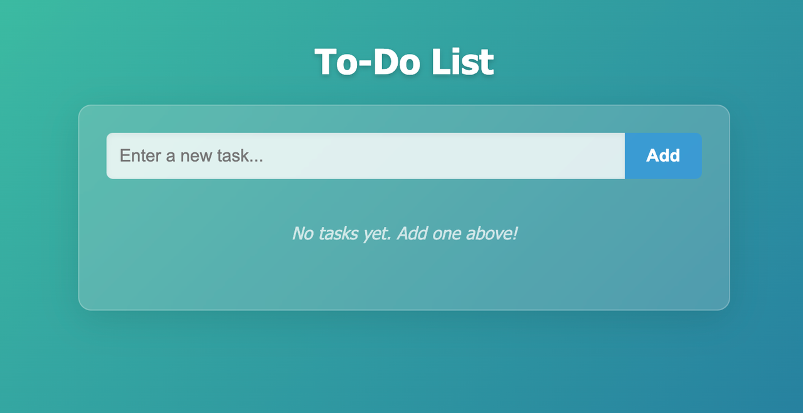

什么是vibe coding?
----------------------------------

 

Vibe Coding是由Andrej Karpathy （前特斯拉 AI 总监）于 2025 年2月推出的一种革命性的编程范式。其核心在于利用 AI（尤其是大型语言模型 (LLM)）来辅助编程。开发人员无需编写每一行代码，只需用自然语言描述所需的功能，AI 即可生成可运行的代码。

这种方法正在迅速获得关注，并被誉为改变游戏规则的方法，甚至非程序员也可以“按照氛围编码”。

下面通过一个示例说明如何使用 AI 从构思到落地，涵盖需求描述、代码生成和分享。即使你是初学者，也能亲身体验Vibe Coding的魅力。

## 从头开始开发待办事项列表 Web 应用程序

### 步骤1：需求分析

首先，我们用自然语言描述核心功能：

- 该页面应该有一个文本输入字段和一个“添加”按钮，以便用户输入和添加任务。
- 添加任务后，它应该作为列表项出现在页面上。
- 每个任务都应该有一个“删除”按钮，以将其从列表中删除。

### 步骤2：创建AI提示词

我们可以将上述需求转化为清晰的AI提示。例如，使用Claude，我们可以询问：

> 请生成一个基于 HTML、CSS 和 JavaScript 的待办事项列表 Web 应用。该页面应包含一个文本输入字段和一个“添加”按钮。当用户输入任务并点击“添加”时，该任务应显示为下方的列表项。每个任务都应有一个“删除”按钮，用于将其从列表中移除。请提供包含所有必要代码的完整 HTML 文件。

说明：此提示词清晰地指定了技术栈（HTML/CSS/JS）、所需的 UI 元素及其行为。像这样结构良好的题目有助于 AI 一次性生成准确、实用的代码。

### 步骤3：AI生成代码

一旦Claude收到该请求，它就会根据其训练数据生成相应的代码解决方案。

 

### 步骤4：调试和改进

进行一些测试来检查核心功能是否按预期运行：

- 输入“买牛奶”，点击添加→待办事项列表显示“买牛奶”，并带有删除按钮。
- 输入“编写代码”，点击添加→列表中出现第二项“编写代码”。出现在列表中。
- 刷新页面→之前添加的任务仍然存在。
- 点击“购买牛奶”旁边的删除按钮→ 该商品已成功移除

 

一切功能正常，接下来改进用户界面。为了提升美观度，我们让Claude为待办事项列表添加了磨砂玻璃（模糊）效果。

 

最终效果：

 

此示例演示了完整的Vibe 编码过程：

**从一个想法开始 → 编写清晰的 AI 提示 → 从 AI 获取初始代码 → 测试并识别问题 → 请求改进 → 接收优化代码**

在整个过程中，我们几乎没有自己编写任何业务逻辑。相反，我们更像是产品经理和测试员，让人工智能来处理代码。这就是Vibe Coding的真正力量——将重点从编写代码转移到构思和细化需求。